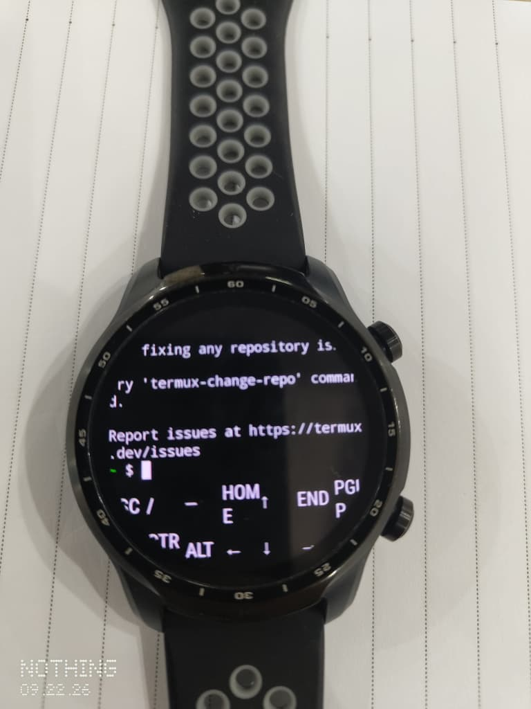

# Termux application

Modified Termux build with fixed before/after images in `assets/`.

| Before | After |
|---|---|
|  |  |

## Build

```sh
./gradlew assembleDebug
```

APK output: `app/build/outputs/apk/debug/`.