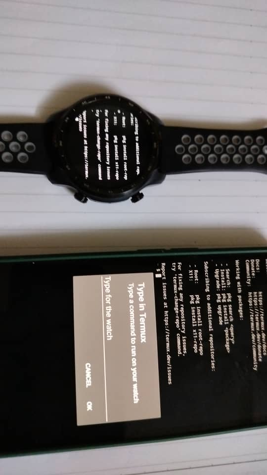

# Termux application

A modified Termux build that targets **Wear OS** as well as Android phones, with a bridge that lets
you type a command on the phone and have it land in the terminal on your watch.

| Before | After |
|---|---|
|  |  |

## Type on phone → run on watch

Press the `📱` key in the watch's extra-keys carousel and the phone takes over command entry. The
typed text travels back over the Wear data layer and is injected into the open terminal on the
watch, submitted with Enter.



**How it works**

| Step | Where |
|---|---|
| Tap `📱` in the carousel | watch |
| Sends `/termux/remote-input-request` | watch → phone |
| Shows an input dialog (Termux open) **or** a notification with a reply box (Termux closed) | phone |
| Reply is read and sent back as `/termux/remote-input-reply` | phone → watch |
| Text is injected into the terminal and submitted with Enter | watch |

The phone does **not** need Termux to be open — the notification path works with Termux closed or
killed, because the message wakes the Play-services-bound `WearableListenerService`. Termux does need
to be **installed** on the phone, though: a watch cannot show a notification or UI on the phone, so
whatever receives the request has to be an app living on the phone.

On Android 13+ the phone needs notification permission for Termux
(`Settings → Apps → Termux → Notifications`) for the reply box to appear.

## What else is in here

### Wear OS UI
- Watch-specific extra-keys layout, tuned as a single row for small round/square screens.
- The soft keyboard no longer auto-opens on launch on a watch — it opens on terminal tap or via the
  `KEYBOARD` key, so the terminal gets the full screen.
- Toolbars, pager and extra-keys view all take the watch branch of the dual-layout code.

### Looping extra-keys carousel with smart auto-hide
- The key row is a horizontally looping (infinite) carousel, so every key is reachable by swiping
  either direction with no dead ends.
- The toolbar row auto-hides to hand vertical space back to the terminal, but no longer vanishes
  mid-interaction: 6s of true inactivity, with any terminal scroll **or any touch on the carousel**
  resetting the timer (handled in `dispatchTouchEvent`, so it resets even when a key button consumes
  the touch).
- Scroll direction still reveals/hides the row, and swiping down on the row hides it immediately.

### Watch keyboard
- A watch-specific `InputConnection` with a command-line buffer that feeds WearGboard's preview strip
  via `getExtractedText`, plus backspace handling and buffer persistence.
- The keyboard **send** button closes the keyboard. Wear OS 2.26 auto-dismissed the IME after the app
  consumed the editor action; Wear OS 3.5 does not, so `performEditorAction` hides the IME
  explicitly (immediately, and again after 150 ms to beat the IME re-showing itself).

## Fixes

- **Phone crash on remote input** — the reply action's `PendingIntent` was immutable, but Android
  rejects immutable intents for `RemoteInput` actions. `notify()` threw and killed the phone's
  listener service before the notification was ever shown. It is now mutable.
- **Phone freeze / "not responding"** — the input dialog was being created on the Wear binder
  thread, and an `AlertDialog` built off the main thread has no prepared `Looper`, causing an ANR. All
  UI work is now posted to the main thread first.

## Install

The same universal APK goes on **both** devices:

```sh
adb -s <phone> install -r app/build/outputs/apk/debug/termux-app_debug_universal.apk
adb -s <watch> install -r app/build/outputs/apk/debug/termux-app_debug_universal.apk
```

## Build

```sh
./gradlew assembleDebug
```

APK output: `app/build/outputs/apk/debug/`. Per-ABI APKs (`arm64-v8a`, `armeabi-v7a`, `x86_64`,
`x86`) and a `universal` APK are all produced; the universal one is the convenient choice for
side-loading to a watch.

## Roadmap

See [`plan.md`](plan.md) for the full list of what shipped and the features queued up next —
command history relay, clipboard sync, delivery ACK/retry, session management, and authenticated
bridging.
